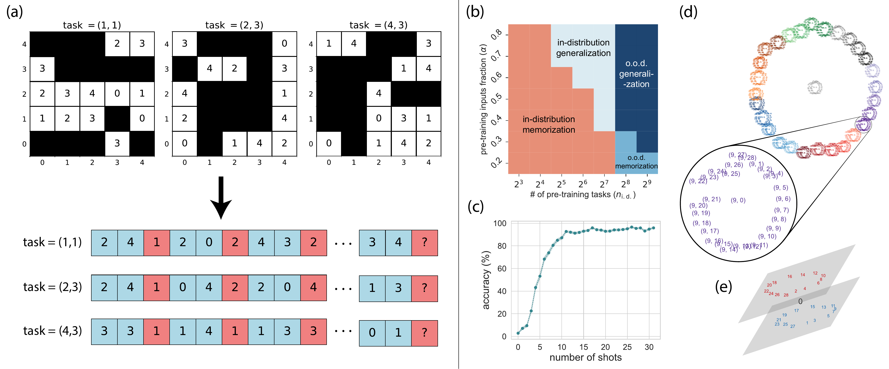

# Learning to grok: Emergence of in-context learning and skill composition in tree structure reasoning

## This is an official implementation of the paper [arXiv:2406.02550](https://arxiv.org/abs/2406.02550).




## Dataset generation

To generate raw training set, run
```bash
python src/ICL/datasets/generate_raw.py
```


To generate eval set, run
```bash
python src/ICL/datasets/generate_eval.py
```

## Train model
To train the transformer model, please update parameters to override in the ```src/ICL/model/conf/yourconf.yaml```
```bash
python src/ICL/model/train.py --config PATH_TO_YOUR_CONFIG_YAML
```


## Evaluation metric
We implement part of the  evalution task to colelct all the results across exp settings
```bash
python src/ICL/eval/collection.py 
```


## Requirements

- Tested Environment:
  - Python == 3.11.4
  - PyTorch >= 2.2
- Run ```pip install -r requirements.txt``` before running experiments
- Run ```pip install pip install -e .``` every time updating codes in the ```ICL``` package


## 🔧 Shared Arguments

All pipeline scripts (dataset generation, training, evaluation) use **identical experiment identifiers** to ensure consistent naming and automatic path resolution:

### Required Arguments
- `--dataset-type` - Distribution type: `uniform` or `zipf`
- `--model-type` - Model architecture: `clm` (causal) or `mlm` (masked)
- `--mixture-type` - Training strategy: `allmix`, `depthmix_L2`, `depthmix_L3`, `depthmix_L4`, `complexmix_low`, `complexmix_high`
- `--total-rules` - Complexity parameter: `144`, `288`, `432`, or `576`
- `--seed` - Random seed for reproducibility

### Pipeline Controls
- `--overwrite` - Replace existing outputs
- `--resume` - Skip if outputs already exist
- `--verbose` - Enable detailed logging
